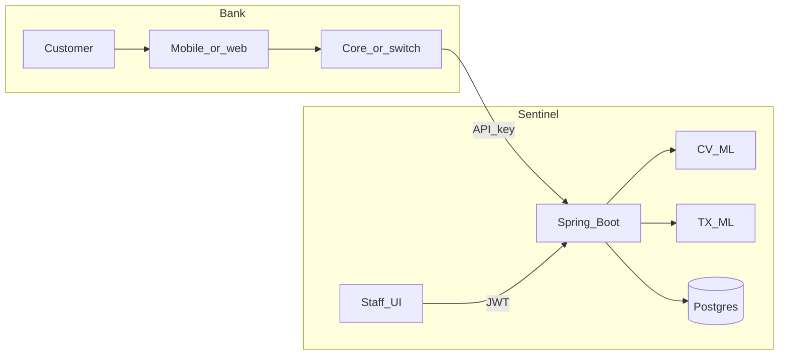
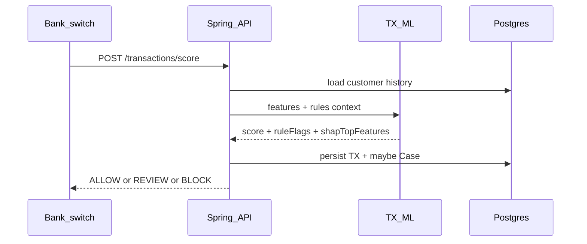
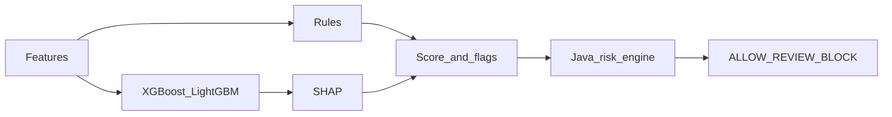

# Sentinel

<p align="center">
  
</p>

**KYC, document fraud checks, and real-time transaction risk scoring for banks.**

Sentinel is a multi-tenant platform that banks integrate behind their own apps. End customers never create a Sentinel account. Bank systems call the API; compliance staff use the dashboard.

<p align="center">
  
</p>

<p align="center">
  
</p>

---

## Overview

| Capability | What happens |
|------------|--------------|
| **KYC** | ID + selfie / liveness challenge → face match, anti-spoof checks, status (`PENDING` / `VERIFIED` / `FLAGGED` / `REJECTED`) |
| **Documents** | Cheque or invoice upload → OCR, tampering score, signature match only if a specimen exists |
| **Transactions** | Bank calls score API on each payment → rules + model + SHAP → `ALLOW` / `REVIEW` / `BLOCK` |
| **Risk & cases** | Signals combine into a 0–100 score; breaches open cases; decisions are audited |

This repository is a computer science final-year project. The design targets how a bank integration would actually work (tenants, staff roles, service credentials, audit). It is not a certified production KYC product.

---

## Actors and access

<p align="center">
  
</p>

| Actor | Touches Sentinel how? | Auth |
|-------|------------------------|------|
| Bank customer | Only via the bank’s app or branch | Bank’s session (not Sentinel) |
| Bank backend / payment switch | Integration API | Service API key (`X-Api-Key`) |
| Admin | Settings, analytics | Staff JWT · `ADMIN` |
| Compliance | Case decisions | Staff JWT · `COMPLIANCE` |
| Analyst | Uploads, investigation | Staff JWT · `ANALYST` |



**Tenant registration (planned / in progress):** bank registers → receives a one-time API key → stores it in their backend → all `/api/integration/**` calls use that key. Staff still log in with username/password.

---

## Main flows

<p align="center">
  
</p>

### 1. Self-verify (customer at home)

1. Customer opens the **bank** app and starts onboarding.  
2. Bank backend creates a KYC session on Sentinel (`externalCustomerId`).  
3. Customer uploads ID and completes a liveness challenge in the bank app.  
4. Bank forwards media to Sentinel; CV/ML scores face match and liveness.  
5. Fail-closed: spoof or poor quality → `FLAGGED` or stay `PENDING`, not auto-`VERIFIED`.  
6. Bank polls status (webhooks later) and continues or holds account opening.  
7. Optionally enroll a signature specimen for later cheque checks.

### 2. Document check

1. Staff or bank systems upload a cheque/invoice linked to a customer.  
2. Always: tampering analysis + OCR.  
3. Signature match only if `referenceSignatureUrl` is set; otherwise `SKIPPED_NO_REFERENCE`.  
4. Risk engine updates the customer; high risk opens a case.

### 3. Payment risk

<p align="center">
  
</p>



<p align="center">
  
</p>

Example response shape:

```json
{
  "recommendation": "REVIEW",
  "anomalyScore": 0.82,
  "explanation": "Amount 4.2x customer 30-day average",
  "shapTopFeatures": [
    { "feature": "amount_vs_avg_30d", "contribution": 0.31 },
    { "feature": "tx_count_24h", "contribution": 0.12 }
  ]
}
```

### 4. Compliance review

Flagged work lands in the case queue. Officers approve / reject / escalate with a mandatory note. Every decision writes an append-only audit row.

---

## Transaction fraud stack



| Stage | Implementation intent |
|-------|------------------------|
| Rules | Amount outliers, velocity, channel/location sanity |
| Model | XGBoost or LightGBM; Isolation Forest as optional anomaly head; train/eval on PaySim |
| SHAP | TreeExplainer (or KernelExplainer fallback); top feature contributions in the API |
| Risk engine | Per-tenant weights and thresholds in Postgres |
| Cases | Auto-open on `REVIEW` / `BLOCK` and KYC/document policy breaches |

Document / KYC models: OCR, Siamese signature networks (CEDAR), Error Level Analysis, face embeddings, challenge-based liveness.

---

## Architecture

| Component | Port | Stack | Role |
|-----------|------|-------|------|
| `backend` | 8080 | Java 17, Spring Boot 3, JPA, Security, springdoc | Product API, persistence, risk, cases, audit |
| `cv-ml` | 8001 | Python, FastAPI, PyTorch / CV libs | KYC + document inference |
| `transaction-ml` | 8002 | Python, FastAPI, XGBoost, SHAP | TX rules, scores, explanations |
| `frontend` | 5173 | React, TypeScript, Vite, Tailwind | Marketing site + staff desk (desk in progress) |
| `postgres` | 5432 | PostgreSQL | Authoritative store |

Design choices:

- Spring is the only public API; Python services are internal.  
- CV jobs can be async; TX score is synchronous on the payment path.  
- Schema is multi-tenant (`tenant_id` on domain tables).  
- Hibernate `ddl-auto: update` for now (Flyway off).  
- Demo data seeded: tenant `demo-bank`, staff users, default risk settings.

```text
sentinel/
├── backend/                      Spring Boot
│   └── src/main/java/com/sentinel/
│       ├── auth/                 JWT login, refresh, RBAC
│       ├── tenant/               Institutions
│       ├── customer/             KYC subjects
│       ├── document/             Cheque / invoice evidence
│       ├── transaction/          Payment records + recommendations
│       ├── risk/                 Weights, thresholds
│       ├── casemanagement/       Review queue
│       ├── audit/                Append-only log
│       ├── integration/          Outbound ML + bank callbacks
│       ├── websocket/            Case push
│       └── common/               OpenAPI, errors, /api/me
├── services/cv-ml/               FastAPI CV
├── services/transaction-ml/      FastAPI TX + SHAP
├── frontend/                     React
├── datasets/                     CEDAR, PaySim, synthetics (gitignored binaries)
├── docs/                         Specs + docs/assets diagrams
├── docker-compose.yml
└── .env.example
```

Diagrams (animated SVG): [docs/assets/](docs/assets/).

| Diagram | Shows |
|---------|--------|
| `architecture.svg` | Full system topology |
| `multi-tenant.svg` | Tenant isolation |
| `decision-pipeline.svg` | Capture → govern |
| `tech-stack.svg` | Stack chips |
| `payment-path.svg` | Live TX score loop |
| `shap-bars.svg` | Example SHAP contributions |

---

## Current progress

| Area | Status |
|------|--------|
| Monorepo, docs, Docker Postgres | Done |
| React marketing landing | Done |
| Backend auth (JWT, refresh, roles) | Done |
| Multi-tenant entities + seed (`demo-bank`) | Done |
| Swagger, `/api/me`, actuator health | Done |
| Tenant API keys + `/api/tenants/register` | Next |
| KYC sessions, specimen upload, document verify stubs | Next |
| Live TX score + SHAP service | Next |
| CV model training (CEDAR, liveness) | Planned |
| Staff dashboard, WebSockets, webhooks | Planned |

Roadmap detail: [docs/scope-and-timeline.md](docs/scope-and-timeline.md).

---

## Prerequisites

- JDK 17+  
- Maven 3.9+ (or IntelliJ’s bundled Maven)  
- Node 18+ (frontend)  
- Docker (Postgres) — optional if you use the H2 profile  
- Python 3.11+ (when running ML services)

---

## Run locally

### 1. Environment

```bash
cp .env.example .env
```

Important variables:

| Variable | Purpose |
|----------|---------|
| `POSTGRES_*` | Database connection |
| `JWT_SECRET` | Access-token signing (≥ 32 chars) |
| `CV_ML_BASE_URL` | Default `http://localhost:8001` |
| `TRANSACTION_ML_BASE_URL` | Default `http://localhost:8002` |
| `VITE_API_BASE_URL` | Frontend → backend |

### 2. Database

```bash
docker compose up -d postgres
```

Optional async broker: `docker compose --profile async up -d rabbitmq`

### 3. Backend

```bash
cd backend
mvn spring-boot:run
```

Without Docker:

```bash
mvn spring-boot:run "-Dspring-boot.run.profiles=h2"
```

| URL | Use |
|-----|-----|
| http://localhost:8080/swagger-ui.html | OpenAPI UI |
| http://localhost:8080/actuator/health | Health |
| `POST /api/auth/login` | Staff tokens |
| `GET /api/me` | Current user + tenant |

Demo staff (tenant `demo-bank`):

| Username | Role | Password |
|----------|------|----------|
| `admin` | ADMIN | `ChangeMe123!` |
| `compliance` | COMPLIANCE | `ChangeMe123!` |
| `analyst` | ANALYST | `ChangeMe123!` |

More backend detail: [backend/README.md](backend/README.md).

### 4. Frontend

```bash
cd frontend
npm install
npm run dev
```

Open http://localhost:5173

### 5. ML services (when implemented)

```bash
cd services/cv-ml && uvicorn app.main:app --port 8001
cd services/transaction-ml && uvicorn app.main:app --port 8002
```

Contracts: [docs/ml-contracts.md](docs/ml-contracts.md).

---

## API surface (summary)

Full tables: [docs/api-contracts.md](docs/api-contracts.md).

**Staff**

- `POST /api/auth/login`, `POST /api/auth/refresh`  
- Customer / document / case / admin routes (JWT + roles)

**Bank integration** (service key)

- KYC session start / submit / status  
- Signature specimen enroll  
- Document verify  
- `POST .../transactions/score` (primary payment path)  
- Bulk TX import (backfill only)

---

## Datasets

| Need | Source | Location |
|------|--------|----------|
| Signatures | CEDAR | `datasets/cedar/` (download locally) |
| Transactions | PaySim | `datasets/paysim/` |
| IDs / cheques | Synthetic templates | `datasets/synthetic/` |

Large files are gitignored; keep README stubs in those folders.

---

## Documentation index

| Doc | Contents |
|-----|----------|
| [docs/product-vision.md](docs/product-vision.md) | Product rules and workflows |
| [docs/architecture.md](docs/architecture.md) | Component design |
| [docs/data-model.md](docs/data-model.md) | Entities and fields |
| [docs/api-contracts.md](docs/api-contracts.md) | REST + WebSocket contracts |
| [docs/ml-contracts.md](docs/ml-contracts.md) | CV and TX ML APIs |
| [docs/functional-requirements.md](docs/functional-requirements.md) | FR list |
| [docs/nfr.md](docs/nfr.md) | Non-functional requirements |
| [docs/evaluation-metrics.md](docs/evaluation-metrics.md) | Metrics (incl. SHAP checks) |
| [docs/demo-script.md](docs/demo-script.md) | Demo / viva script |
| [docs/scope-and-timeline.md](docs/scope-and-timeline.md) | Phases P0–P3 |

---

## License / data

Academic / FYP use. Prefer synthetic PII in public demos. See [docs/nfr.md](docs/nfr.md) for retention and privacy notes.
